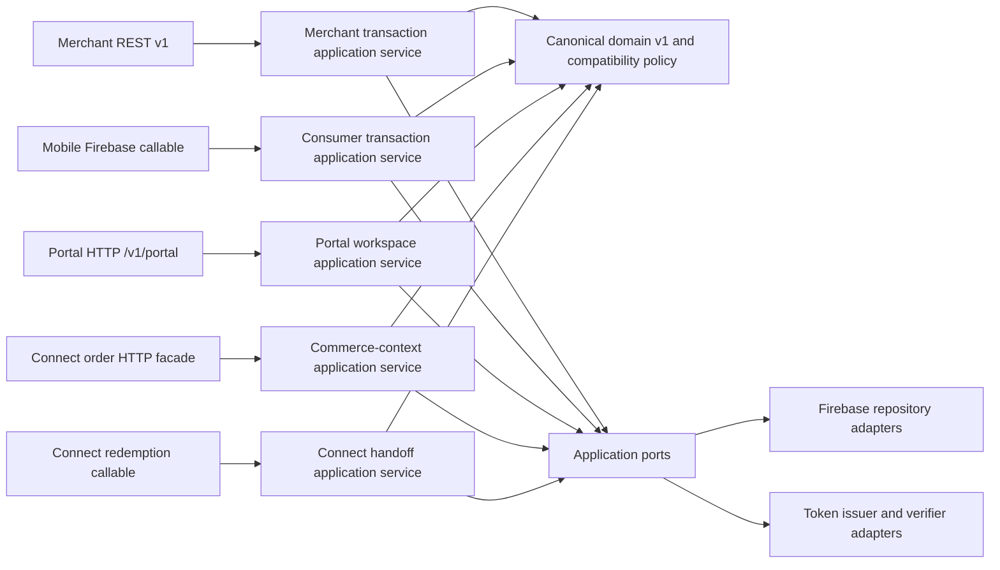

# PackProof shared application services v1

Status: active source/emulator migration slice on 2026-08-11. Selected merchant REST, consumer callable and PackProof API operations now invoke transport-neutral application services. This is not a deployed-environment or device claim.

## 1. Architectural result

PackProof now has an application layer between transports and Firebase:



Application source is under `functions/src/application/v1`. Firebase and cryptographic implementations are under `functions/src/infrastructure`. The application package imports neither Firebase, Express, Expo, React nor React Native.

The existing `api/v1/transaction-service.ts` path remains as a compatibility export, but its implementation is now the shared `MerchantTransactionApplicationService`. Express owns HTTP concerns only: authentication transport, request parsing, rate limiting, response envelopes and application-error translation.

## 2. Active services and responsibilities

| Service | Active transport | Owns | Does not own |
|---|---|---|---|
| `MerchantTransactionApplicationService` | `/v1` create/get/list transactions | Environment/scope policy, idempotent creation, canonical compatibility, query authorization, event request and audit request | Bearer parsing, HTTP status/envelope, Firestore encoding |
| `ConsumerTransactionApplicationService` | `saveTransactionDraft` callable | Free-plan active-transaction policy, seller ownership, editable-state policy, draft construction, canonical compatibility and event request | Firebase Auth extraction, App Check, Firestore query/write encoding |
| `CommerceContextApplicationService` | Connect order-ingestion HTTP facade | Stable idempotency identity, authoritative commerce snapshot, item-description propagation, field provenance, stable handoff token request and context event | API-key lookup, callback DNS/SSRF validation, HTTP response shape |
| `ConnectHandoffApplicationService` | `redeemConnectSession` callable | Expiry, claimant exclusivity, one-time token policy, replay, transaction construction, canonical compatibility and event request | Firebase Auth extraction, Firestore transaction encoding, hash implementation |
| `PortalWorkspaceApplicationService` | `/v1/portal` home, transactions, timeline, evidence metadata, Passport, native capture handoff | Participant resource authorization, portal DTO mapping, Passport projection reuse, native-only capture handoff URLs, `WEB_PORTAL` audit metadata | Firebase ID token / App Check parsing, HTTP envelope, Firestore encoding, native capture, browser upload |

Every transaction created by these services is translated through the Section 2 canonical transaction DTO parser before persistence. Existing consumer and merchant Firestore shapes remain the active compatibility storage format; passing the canonical parser prevents the new service layer from creating a record that cannot be represented by the canonical model.

## 3. Ports

The application layer declares ports for:

- merchant transaction create/read/list persistence;
- consumer draft allocation, quota lookup, read and atomic save;
- commerce-context and compatibility-handoff atomic creation/replay;
- Connect handoff atomic redemption;
- idempotency execution;
- merchant audit append;
- handoff-token issuance and digesting;
- constant-time handoff-token verification; and
- injected clocks for deterministic policy and tests.

Transaction IDs are supplied by the idempotency boundary or repository adapter so an application service does not know Firestore document construction. Cryptographic token implementations use reviewed Node platform primitives behind the declared issuer/verifier interfaces.

## 4. Unit-of-work and outbox boundary

Externally relevant migrated writes now include a stable, schema-versioned `ApplicationEvent`. Firebase adapters persist a `domainOutbox/{eventId}` record atomically with the business mutation.

| Operation | Atomic Firestore unit |
|---|---|
| Merchant REST transaction creation | Merchant-compatible transaction plus `TRANSACTION_CREATED` outbox event |
| Consumer draft creation/update | Consumer-compatible transaction, participant timeline event and outbox event |
| Connect order ingestion | Canonical commerce context, legacy-compatible Connect session and `COMMERCE_CONTEXT_CREATED` outbox event |
| Connect session redemption | Consumer-compatible transaction, Connect-session claim/token deletion, participant timeline event and `TRANSACTION_CREATED` outbox event |

Events contain a stable ID, `schemaVersion: 1`, type, tenant when known, bounded actor reference, resource, request ID, occurrence time and non-secret data. They do not contain API keys, webhook secrets, handoff tokens, callback credentials, raw media or full item descriptions.

The existing merchant hash-linked API audit stream is still appended after the atomic transaction/outbox commit. If that append fails, the transaction and outbox fact remain durable and the idempotency retry can finish the audit append. The outbox is the recovery boundary; it is not a claim of exactly-once external delivery.

No outbox dispatcher is implemented in Section 3. New records remain `PENDING` until a later event-platform section introduces leasing, delivery, retry, replay, dead-letter behavior and retention. This is deliberate: creating a dispatcher without its complete operational controls would turn a durable record into an unproven side-effect mechanism.

## 5. Commerce description propagation

The first active commerce-context producer is the existing authenticated Connect order-ingestion facade. It now maps the supplied order into:

- a stable `ctx_...` commerce-context ID;
- `MERCHANT_SERVER_ATTESTED` source trust;
- external order and integration references;
- title and full merchant item description;
- price/currency and external-order identifier;
- field provenance for title, description, amount and identifiers;
- canonical payload SHA-256;
- `ORDER_BOUND` status; and
- a seven-day handoff association.

The compatibility Connect session retains the existing session ID, deterministic token derivation, response fields and redemption URL. It additionally references the canonical context and stores the normalized item descriptor. Matching idempotent retries can backfill a missing canonical context for a legacy session without changing its session ID or handoff URL.

Connect redemption carries `commerceContextId` into the transaction source. The merchant description therefore follows:

```text
authenticated commerce request
  -> immutable commerce context
  -> compatibility handoff session
  -> claimed PackProof transaction
  -> existing mobile capture workflow
```

The reusable architectural boundary is the commerce-context application service and repository port. Future Shopify, WooCommerce, Magento, marketplace and custom-button adapters must map their authenticated data into this boundary. They must not create transactions or Firestore documents directly.

The browser button itself is not implemented in Section 3. Page-extracted data will use `PAGE_DECLARED`, can populate a draft, and cannot enter `ORDER_BOUND` without merchant-server or platform-API confirmation.

## 6. Error and authorization boundary

Application services throw `ApplicationError` with transport-neutral categories and stable application codes. Adapters translate them as follows:

- Express maps categories to HTTP statuses and preserves the existing `/v1` error envelope.
- Firebase callables map categories to `HttpsError` codes and place the application code in structured details.
- Connect HTTP retains the existing compatibility error names for platform mismatch and idempotency conflict.

Authorization remains layered:

- REST authentication and rate limiting remain transport controls;
- merchant environment and scope checks live in the application policy;
- consumer identity is extracted by the callable and seller/editability checks live in the application service;
- Connect API-key and callback allowlist/DNS validation remain at the ingestion boundary;
- Connect claimant, expiry and token redemption policy live in the application service;
- portal identity is extracted by the `/v1/portal` authenticator and participant resource checks live in the portal application service; and
- Firestore adapters recheck ownership/current state inside their transactions to prevent time-of-check/time-of-use bypass.

## 7. Compatibility and public-contract preservation

- Existing `/v1` transaction request, response, status, pagination, idempotency and error shapes are unchanged.
- Existing `saveTransactionDraft` input/output and active Firestore transaction fields are unchanged.
- Existing Connect ingestion session ID and token derivation are unchanged.
- Existing Connect response fields and replay flag are unchanged.
- Existing Connect redemption output remains `{ transactionId, connectSessionId }`.
- Current consumer queries remain unable to see merchant API transactions until an explicit participant claim exists.

The current `saveTransactionDraft` callable contract has no client operation key or expected record version. Section 3 therefore preserves its existing last-writer behavior for concurrent edits and cannot claim request-level idempotency for draft updates. The Firebase adapter rechecks seller ownership and editable state inside the write transaction, but a later versioned command must add an operation key and optimistic version before concurrent-edit safety can be claimed.

The migration also corrected the internal domain base type: a versioned resource no longer automatically contains `organizationId`. Organization-scoped resources opt into it; consumer/participant resources may be transaction-scoped, and a transaction may have a nullable organization association internally. Public DTOs did not change.

## 8. Security-rule boundary

`commerceContexts` and `domainOutbox` are server-only collections. Firestore rules explicitly deny client reads and writes, and the emulator suite tests both denials. Commerce descriptions and external references therefore do not become generally readable merely because they are normalized into a canonical context.

## 9. Current activation matrix

| Path | Application-layer status |
|---|---|
| REST transaction create/get/list | Active through shared service |
| Consumer draft create/update | Active through shared service |
| Consumer transaction intake ingest/list/start | Active through shared service; Android share/import and Find my order call the same service |
| Connect order ingestion/context creation | Active through shared service |
| Connect redemption/transaction creation | Active through shared service |
| Invite creation/redemption | Still legacy callable logic |
| Terms confirmation and transaction transitions | Still legacy callable logic |
| Evidence reservation/finalization | Still legacy callable/trigger logic |
| Shipment and Return Passport commands | Still legacy callable logic |
| Reports, notifications and account lifecycle | Still legacy services/helpers |
| Outbox dispatch/retry/dead letter | Not implemented |
| Public commerce-context REST resource | Not implemented |
| PackProof browser/checkout button | Not implemented |
| Portal workspace home/list/get/Passport/native handoff | Active through shared service; Hosting/DNS/live App Check not claimed |
| Shopify/WooCommerce/Magento adapters | Not implemented |
| Deployed Firebase validation | Not performed for Section 3 |
| Exact Android binary/device validation | Not performed for Section 3 |

This is a strangler migration. The remaining direct-Firebase paths are explicitly visible and will move only after equivalent command, authorization, state and emulator tests exist.

Consumer transaction intake (`TransactionIntakeApplicationService`) is an application service over the same `commerce_context` and `passport_draft` resources. Email, share-sheet, screenshot, and PDF adapters create `USER_PROVIDED_COMMERCE_ARTIFACT` snapshots; browser-extension intake remains `PAGE_DECLARED`. `ingest` / `ingestArtifact` do not create a `transaction` and do not authoritatively bind an order. `start` creates a consumer `DRAFT` transaction and claims the context. See [ADR 0013](../adr/0013-transaction-intake-layer.md).

## 10. Executable gates

Run:

```text
npm run test:application
npm run test:application:firestore
npm run test:api
npm run test:api:firestore
npm run test:rules
```

The application unit suite covers canonical mapping, authorization, idempotency, quota, ownership, editability, commerce provenance, stable handoff, token validation, expiry, claimant isolation and replay. Firestore integration tests prove the business record, compatibility record where applicable, participant event and outbox event are committed as designed.

Passing these gates is `SOURCE_CHECKED` and `EMULATOR_CHECKED` evidence. It does not establish deployed cloud behavior, commerce-platform acceptance, browser integration, SDK compatibility outside the existing tests, APK provenance or device behavior.
