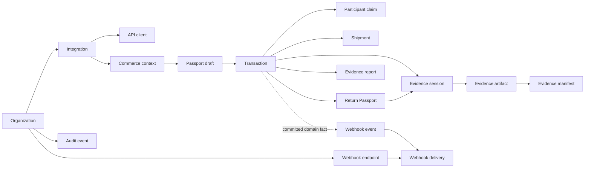

# PackProof canonical domain model v1

Status: `SOURCE_CHECKED` on 2026-08-11. The model is implemented and unit-tested. Selected REST, callable and Connect paths adopted it through the later Section 3 application layer; see `APPLICATION_SERVICES_V1.md` for the exact active boundary.

## 1. Purpose and boundary

This model gives PackProof one vocabulary for mobile workflows, merchant APIs, PackProof API, commerce-platform adapters, evidence processing, reports, webhooks and audit history. It is the pure policy and contract layer required before those transports can share application services.

The source is `functions/src/domain/v1`. It imports no React, React Native, Expo, Express, Firebase Functions, Firestore, Cloud Storage or commerce-platform SDK. It currently lives under the Functions TypeScript package so the deployable backend build owns one compiled copy while the migration is in progress.

The Section 2 implementation by itself did **not**:

- route an existing callable or HTTP request through the new model;
- create or migrate a Firestore collection;
- deploy a Firebase function or commerce adapter;
- prove a browser, checkout, Shopify, WooCommerce or marketplace integration;
- change the current Android evidence queue or finalizer; or
- enable physical matching or convert digital evidence into a physical-authenticity conclusion.

Those integrations begin only after application services and ports are introduced in Section 3.

## 2. Resource graph



The graph describes canonical relationships, not current Firestore joins or deployed endpoints. Transaction-participant and organization boundaries still require server authorization at every command and query.

## 3. Canonical resource catalog

Every public resource has a stable `object`, `schemaVersion: 1`, kind-bound ID, and ISO-8601 `createdAt`/`updatedAt` values. Internal persistence types carry server-only fields and native `Date` values. Firestore records are never public DTOs by implication.

| Resource | Canonical ID | Intended persistence boundary | Principal role |
|---|---|---|---|
| Organization | `org_...` | `organizations/{organizationId}` | Tenant and environment boundary |
| Integration | `int_...` | `integrations/{integrationId}` | Platform or custom-checkout installation |
| API client | `client_...` | `apiClients/{apiClientId}` | Scoped server credential identity; never a browser secret |
| Commerce context | `ctx_...` | `commerceContexts/{commerceContextId}` | Immutable, provenance-bearing listing/cart/order snapshot |
| Passport draft | `draft_...` | `passportDrafts/{passportDraftId}` | User-reviewable prefilled passport data before binding |
| Transaction | `txn_...` | `transactions/{transactionId}` | Agreed item, terms, participants and aggregate workflow |
| Participant claim | `claim_...` | `participantClaims/{claimId}` | Bounded conversion of an external reference into an authenticated actor |
| Evidence session | `es_...` | Transaction evidence-session subcollection | Purpose-, actor-, protocol- and artifact-bounded capture operation |
| Evidence artifact | `art_...` | Transaction evidence subcollection | Finalized or quarantined media/document metadata and assurance |
| Evidence manifest | `manifest_...` | Private manifest namespace | Deterministic artifact/bundle binding and explicit authentication metadata |
| Shipment | `shipment_...` | Transaction shipment subcollection | Carrier/tracking assertion and evidence associations |
| Return Passport | `return_...` | Transaction return subcollection | Authorized reverse-logistics workflow and original-hash snapshot |
| Evidence report | `report_...` | Transaction report subcollection | Authorized presentation derivative with source lineage |
| Webhook endpoint | `wh_...` | Organization endpoint subcollection | Subscription and endpoint state; secret stays internal |
| Webhook event | `evt_...` | System event store | Stable external representation of a committed domain event |
| Webhook delivery | `delivery_...` | Delivery store | At-least-once endpoint delivery, retry and replay state |
| Audit event | `audit_...` | Organization audit subcollection | Actor/resource/request-linked, hash-chain-ready history |

The executable resource catalog also declares tenant boundaries, idempotency rules, required audit event families and fields that must remain internal. Its completeness is tested against all 17 resource kinds.

## 4. Identifier and version policy

- Canonical identifiers are non-sequential opaque strings with a resource-specific prefix and at least eight opaque characters after the prefix.
- A parser rejects an identifier of the wrong resource kind even if its shape is otherwise valid.
- Legacy Firestore identifiers are accepted only when a caller explicitly opts into a compatibility path.
- DTOs reject unknown fields. This prevents internal fields from being silently serialized through a public boundary.
- `schemaVersion` versions a resource representation. Breaking public changes require a new representation or API/event version; version 1 is not mutated incompatibly.
- `object` is a stable discriminator for SDKs and webhook consumers.

## 5. Commerce context and PackProof-button flow

The commerce context is the bridge between an existing commerce page or checkout and a PackProof passport. It is deliberately separate from both the user-editable draft and the transaction.

```mermaid
sequenceDiagram
  participant Page as Merchant page or checkout
  participant Adapter as PackProof button/adapter
  participant API as PackProof API
  participant Domain as Commerce-context service
  participant User as PackProof participant

  Page->>Adapter: Product, variant, quantity and displayed terms
  Adapter->>API: Versioned context request plus operation key
  API->>Domain: Authenticated tenant/integration command
  Domain-->>API: Immutable context with field provenance
  API-->>Adapter: Short-lived handoff reference
  Adapter->>User: Open PackProof review flow
  User->>Domain: Review or correct a passport draft
  Note over Domain: Corrections are new assertions; imported history is not overwritten
  API->>Domain: Merchant-server/platform order confirmation
  Domain-->>User: Order-bound transaction/passport association
```

The canonical `ItemDescriptor` supports title, detailed description, category, brand, model, SKU, GTIN, UPC, MPN, serial number, selected options, additional identifiers, quantity, amount and image references. That makes description re-entry unnecessary when a trusted integration already supplied the fields.

Every imported field can carry:

- assertion source;
- `ASSERTED`, `OBSERVED` or `DERIVED` confidence class;
- import time; and
- source reference.

The context also records platform, external shop/product/listing/variant/order/line-item references, product URL, canonical payload SHA-256, lineage to a superseded context and optional expiry.

### Trust classes

| Trust class | May prefill a draft | May authoritatively bind an order | Meaning |
|---|---:|---:|---|
| `MERCHANT_SERVER_ATTESTED` | Yes | Yes, after authorization and command policy | Supplied by an authenticated merchant backend |
| `PLATFORM_API_ATTESTED` | Yes | Yes, after authorization and command policy | Obtained through an authenticated commerce-platform API |
| `PAGE_DECLARED` | Yes | No | Browser/page data such as JSON-LD, DOM attributes or button parameters |

Page-declared input is useful convenience data, but it does not establish payment, authoritative order existence, buyer identity, custody, product authenticity or physical truth. Listing image references are source references, not PackProof evidence artifacts. The runtime policy tests both restrictions.

### Commerce-context lifecycle

```text
CREATED -> HANDOFF_ISSUED -> CLAIMED -> ORDER_BOUND
   |              |            |
   +--------------+------------+-> EXPIRED or REVOKED
```

`ORDER_BOUND`, `EXPIRED` and `REVOKED` are terminal in v1. A changed source snapshot becomes an explicitly superseding context; it does not rewrite a claimed or order-bound snapshot.

Passport drafts follow:

```text
DRAFT -> READY_FOR_REVIEW -> BOUND
  |              |
  +--------------+-> EXPIRED or CANCELLED
```

## 6. Transaction and participant model

A transaction records origin, item, terms, participant references and three independent state facets:

- terms: `DRAFT`, `AWAITING_PARTICIPANTS`, `IN_REVIEW`, `LOCKED`, `CANCELLED`;
- fulfillment: `NOT_STARTED`, `PACKING`, `PACKED`, `IN_TRANSIT`, `RECEIVER_REVIEW`, `COMPLETED`, `DISPUTED`, `NOT_APPLICABLE`; and
- aggregate: `DRAFT`, `ACTIVE`, `COMPLETED`, `DISPUTED`, `CANCELLED`, `ARCHIVED`.

The aggregate transition table is:

```text
DRAFT -> ACTIVE -> COMPLETED -> ARCHIVED
  |        |           |
  |        +-> DISPUTED+-> COMPLETED, CANCELLED or ARCHIVED
  +-> CANCELLED -----------------------------> ARCHIVED
```

The separate facets prevent a transport from collapsing “terms are locked,” “package is in transit,” and “transaction is active” into a single ambiguous status.

Public participant DTOs contain a role, external reference, optional display label and claim state. Internal actor IDs and claim-token material do not appear in the public transaction DTO. A participant claim has its own one-time, expiring lifecycle:

```text
ISSUED -> CLAIMED
   |----> EXPIRED
   +----> REVOKED
```

An email address, marketplace ID, display label, URL parameter or external reference is not authorization. Only a server-authorized claim command may bind an authenticated PackProof actor.

## 7. Evidence model and proof boundary

An evidence session identifies capture purpose, protocol version, actor role, allowed artifact types, expiry and three operational facets: capture, sync and processing. Its aggregate lifecycle includes retryable and terminal failures without mislabeling technical failure as an evidence mismatch.

```text
CREATED -> READY -> CAPTURING -> CAPTURED -> SYNCING -> PROCESSING
                                                            |-> FINALIZED
                                                            +-> FINALIZED_WITH_LIMITATIONS
Retryable stages -> FAILED_RETRYABLE -> eligible retry stage
Non-recoverable stages ----------------> FAILED_TERMINAL
Eligible pre-final stages --------------> CANCELLED
```

An artifact is distinct from its bytes and private storage locator. Its public DTO may expose declared content type, size, server-bound SHA-256, manifest reference, status and assurance. It does not expose the Cloud Storage path, uploader actor, raw telemetry or ingress signals.

Workflow advancement requires a server-finalized artifact with no byte-integrity mismatch. `UPLOADED`, locally encrypted, queued, awaiting finalization, quarantined and failed are not completion.

Assurance remains six-dimensional:

1. acquisition quality;
2. app/device context;
3. byte integrity;
4. physical correspondence;
5. carrier context; and
6. business/legal relevance.

The model allows explicit reason codes and does not infer one dimension from another. In the current product, physical correspondence remains `NOT_AVAILABLE` with `NO_VALIDATED_PHYSICAL_MATCHER_ENABLED` unless a future implementation passes the separate validation gate.

Manifest authentication is a tagged union:

- `SERVICE_MAC` with `HMAC-SHA256` and service-only verification scope; or
- `ASYMMETRIC_SIGNATURE` with explicit algorithm, key ID and public-key verification scope.

The model explicitly reports that the current HMAC is not publicly verifiable. A future asymmetric signer cannot silently relabel an old HMAC record.

## 8. Shipment and return boundaries

Shipment state is independent from transaction aggregate state:

```text
PENDING -> PACKED -> IN_TRANSIT -> DELIVERED -> RECEIVER_REVIEW -> COMPLETED
                         |             |              |
                         +-------------+--------------+-> DISPUTED
PENDING or PACKED ---------------------------------------> CANCELLED
```

Carrier/tracking information carries an assertion source: participant, merchant, platform adapter, carrier adapter or PackProof barcode observation. A tracking number or observed label does not itself prove external carrier custody.

Return Passports follow `REQUESTED -> AUTHORIZED -> PACKED -> IN_TRANSIT -> RECEIVED_REVIEW -> COMPLETED`, with explicit cancellation/dispute routes. Their original-evidence hash snapshot documents the prior digital record. It does not determine that a returned physical object is the same object.

## 9. Organization, API, webhook and audit boundaries

- Organizations separate sandbox and live resources.
- Integrations identify a platform/account installation and allowed browser origins. OAuth tokens and webhook secrets remain internal secret references.
- API clients contain name, integration, environment, status and scopes publicly; credential verifiers and pepper/key material stay internal.
- Webhook events represent committed domain facts. One stable event fans out to one delivery identity per endpoint.
- Deliveries are at least once, retryable and replayable. Consumers must deduplicate by stable event/delivery identity.
- Audit events identify actor type, pseudonymous/authorized actor reference, resource, request, event digest and optional previous digest. They exclude secrets and raw media.

Mutation idempotency is resource-specific in the executable catalog. Creation generally binds a stable operation key to a canonical request fingerprint; a repeated key with changed input must conflict rather than mutate the first fact. State commands use command IDs and expected versions. Delivery retries keep stable logical event and delivery identities.

## 10. Compatibility mapping

Two explicit mappers characterize the current split transaction models:

- the consumer Firebase transaction mapper translates the existing flat workflow into canonical terms, fulfillment and aggregate facets while omitting Firebase seller/buyer actor IDs from the public DTO;
- the current merchant REST transaction mapper translates existing API status and participant references without treating an external participant reference as a claimed PackProof identity.

Both outputs pass the strict canonical transaction DTO parser. These are migration adapters, not authorization or persistence implementations. No current record is rewritten by Section 2.

## 11. Current activation matrix

| Area | Section 2 status | Required next boundary |
|---|---|---|
| Pure types and runtime schemas | Implemented and unit-tested | Consume through application commands/queries |
| Resource IDs and versioning | Implemented; legacy opt-in supported | ID factory and persistence adapter |
| State transition declarations | Implemented and exhaustiveness-tested | Command policies with authorization and invariants |
| Commerce provenance and trust | Implemented and policy-tested | Ingestion/application service, then button and platform adapters |
| Consumer/merchant transaction mapping | Implemented and unit-tested | Characterization against repository fixtures/emulator data |
| Evidence truth boundaries | Implemented and policy-tested | Wrap reservation/finalizer services without changing live semantics |
| Public/internal DTO separation | Implemented at domain boundary | HTTP/callable serializers must adopt it |
| Firestore repositories | Partially active through legacy-compatible adapters | Continue resource-by-resource migration; canonical commerce contexts are now persisted |
| Callable/REST/Connect routing | REST transaction, consumer draft, Connect ingestion and redemption migrated | Migrate remaining commands only with equivalence tests |
| PackProof commerce button | Not yet implemented; shared context ingestion boundary is active | Add public hosted handoff/API and platform adapters in a later section |
| Live Firebase, checkout and device behavior | Not yet tested for this model | Deployment and exact-environment acceptance gates |

## 12. Executable verification

Run:

```text
npm run test:domain
```

The gate compiles the Functions package and tests:

- all 17 resource contracts and DTO schemas;
- rejection of unknown/publicly unsafe fields;
- canonical and explicit legacy identifier behavior;
- lifecycle-table completeness and illegal transition rejection;
- commerce source trust and listing-image restrictions;
- evidence advancement and mismatch quarantine policy;
- service-HMAC versus asymmetric verification semantics; and
- both transaction compatibility mappings.

The gate is included in `.github/workflows/ci.yml`. Passing it is source-level evidence only; it does not satisfy emulator, deployed-backend, commerce-platform, exact-binary or device gates.
