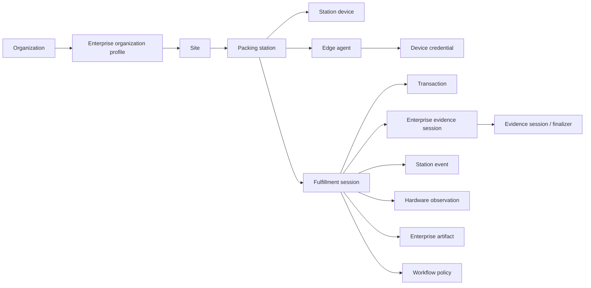

# PackProof Enterprise domain v1

Status: `SOURCE_CHECKED` on 2026-08-17. The model is implemented and unit-tested. It does not create Firestore collections, HTTP routes, or a live warehouse deployment.

## Purpose

Give PackProof one vocabulary for warehouse sites, packing stations, Edge agents, fulfillment sessions, hardware observations, versioned workflow policy, and bounded Enterprise evidence sessions—without placing those concepts inside the canonical commerce `transaction` resource or weakening native evidence rules.

Executable source: `functions/src/domain/v1/enterprise.ts` and `functions/src/domain/v1/edge-protocol.ts`. Application-layer finalization lives in `functions/src/evidence-finalization.ts` and `EnterpriseFulfillmentApplicationService`. The console projection is `EnterpriseConsoleApplicationService`; simulated WMS ingest is `EnterpriseWmsApplicationService`. Finalized Enterprise artifacts require server digest fields and must not carry native App Check attestation.

This catalog is parallel to the original 17 commerce/evidence resource families. Enterprise records reference `organization` and `transaction` identities; they do not replace them.

## Resource graph



## Fulfillment session

Happy path:

```text
CREATED → STATION_BOUND → ACQUIRING → PACKING_COMPLETE → FINALIZING → EVIDENCE_READY → RELEASED
```

Exceptional states are explicit: `INTERRUPTED`, `DEVICE_FAULT`, `EVIDENCE_INCOMPLETE`, `INTEGRITY_FAILURE`, `EXPIRED`, `CANCELLED`. A generic `FAILED` status is not used.

`INTEGRITY_FAILURE` is terminal. Byte-integrity mismatch is never converted into `EVIDENCE_READY`.

`EVIDENCE_INCOMPLETE` may still `RELEASE` in `OBSERVE` / `ASSIST`. Warehouse release is not PackProof evidence readiness. The application layer emits `FULFILLMENT_RELEASED` whenever fulfillment progresses, `PACKPROOF_EVIDENCE_READY` only when required workflow evidence passed, and `FULFILLMENT_RELEASED_WITH_EVIDENCE_LIMITATIONS` when an `OBSERVE`/`ASSIST` release has gaps.

## Policy and modes

Frozen policies:

- `ENTERPRISE_STANDARD_OUTBOUND_V1`
- `ENTERPRISE_HIGH_VALUE_V1`

Operating modes: `OBSERVE`, `ASSIST`, `ENFORCE`. Default: `OBSERVE`.

Policy evaluation records missing requirements. Only `ENFORCE` converts those gaps into a blocking fulfillment gate. Historical records keep the policy version that governed them.

## Edge protocol

Normalized hardware events are defined in `edge-protocol.ts`. Adapter implementations live under `functions/src/edge/v1` and are driven by `apps/edge-agent`. They emit protocol events (`BARCODE_OBSERVED`, `WEIGHT_STABLE`); they do not classify SKU vs tracking and they do not own fulfillment or finalization policy. The trusted application/domain layer derives `EXPECTED_ITEM` / `EXPECTED_TRACKING` / mismatch classifications and creates typed observations. High-value item barcode satisfaction is quantity-aware against `expectedItems`.

## Verification

```text
npm run test:domain
npm run test:application
npm run test:enterprise
```

Passing these gates is source-level evidence only.
