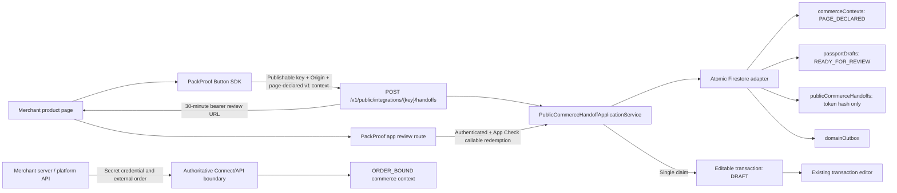

# Public Commerce Context and PackProof Button v1

Status: `SOURCE_CHECKED` and locally tested; Firestore emulator validation is required before this section can be closed. No deployment or real storefront/mobile-device run is claimed by this document.

## Outcome

The PackProof Button can be embedded in a product or listing page with a publishable installation key. On click, the browser SDK reads explicit integration data, Schema.org `Product` JSON-LD, or a narrow Open Graph fallback and sends a versioned item descriptor to PackProof. PackProof creates a short-lived commerce handoff and passport draft. A signed-in PackProof user redeems the one-use bearer link and lands on the existing editable transaction form with the title, complete description, category, price/currency, identifiers, brand/model, selected options, and HTTPS listing image references already populated. Listing images remain page-declared references; they are not PackProof evidence, hashes, or capture originals.

The public route does not authenticate a merchant or assert that an order, payment, shipment, condition, authenticity result, or evidence capture exists.

## Boundaries and components



The browser and merchant-server paths intentionally converge on the same canonical `commerce_context`, `passport_draft`, `transaction`, application-event, and outbox vocabulary, but they do not share authority:

| Source | Credential | Trust | May supply external order ID | May reach `ORDER_BOUND` |
| --- | --- | --- | --- | --- |
| PackProof Button | Publishable installation key and exact allowlisted browser Origin | `PAGE_DECLARED` | No | No |
| Connect / merchant server | Secret server credential | `MERCHANT_SERVER_ATTESTED` | Yes | Yes |
| Future platform adapter | Server-side platform authorization | `PLATFORM_API_ATTESTED` | Yes | Yes |

`commerceContextCanAuthoritativelyBindOrder` is the domain guard. An `ORDER_BOUND` context must have a non-page-declared trust level and an external order ID.

## Public HTTP contract

The additive v1 operation is defined in `docs/openapi/packproof-api-v1.json`:

```text
OPTIONS /v1/public/integrations/{publishableKey}/handoffs
POST    /v1/public/integrations/{publishableKey}/handoffs
```

The POST requires:

- a publishable key matching the active API environment;
- an exact allowlisted HTTPS `Origin`;
- `Content-Type: application/json`;
- an 8-200 character retry-stable `Idempotency-Key`;
- `schemaVersion: 1`;
- a product URL on the same origin as the calling page;
- a strict `source` object that intentionally has no order, payment, buyer, shipment, or evidence fields;
- a strict canonical item descriptor.

The response is always labeled `trustLevel: PAGE_DECLARED` and `status: PENDING_CLAIM`. Its `reviewUrl` is a short-lived bearer URL and must not be logged, persisted in analytics, or sent to third parties.

## Extraction and field provenance

The browser SDK uses this precedence:

1. Explicit integration `data` passed to `mountPackProofButton`.
2. Schema.org `Product` JSON-LD.
3. A narrow fallback of product Open Graph metadata and the document title.

It never sends arbitrary page text, cookies, local storage, payment fields, or browser credentials. It sends requests with `credentials: omit` and never accepts a merchant API key or webhook secret.

Every populated descriptor field is recorded with:

- `source: MERCHANT_PAGE_STRUCTURED_DATA`;
- `confidence: ASSERTED`;
- the server import time;
- the product URL as source reference.

Listing image URLs remain `imageReferences`. The domain explicitly states that a commerce image reference is not finalized PackProof evidence.

## Idempotency and lifecycle

The handoff ID is deterministic from integration, exact origin, and client operation key. The request fingerprint is separately computed from the integration, origin, and canonical v1 payload.

- Same identity and same fingerprint: return the original handoff and deterministic bearer token.
- Same identity and different fingerprint: return `409 IDEMPOTENCY_KEY_REUSED`.
- Different operation key: create an independent handoff.
- Handoff lifetime: 30 minutes.
- Token persistence: SHA-256 digest only.
- First valid authenticated claim: atomically create one transaction and consume the token.
- Same actor replay after claim: return the original transaction.
- Different actor after claim: reject with `PUBLIC_HANDOFF_ALREADY_CLAIMED`.

Issuance atomically writes the commerce context, passport draft, handoff, and two outbox events. Redemption atomically writes the editable transaction, transaction timeline event, context/draft state changes, token deletion, and two outbox events.

## Review semantics

Redemption creates a legacy-compatible transaction with canonical origin `COMMERCE_ADAPTER` and legacy source `PACKPROOF_BUTTON`. Its state is `DRAFT`, not `TERMS_LOCKED`. The user is sent to `/transaction/new?transactionId=...`, where the existing form hydrates all imported fields, renders HTTPS listing image references as page-declared previews, and shows a persistent page-declared warning. Subsequent edits preserve the source linkage and listing image references because the consumer repository merges editable fields without deleting those objects.

The active legacy consumer transaction model is seller-initiated, so the redeeming account becomes the draft seller. A future role-neutral passport-draft/participant-claim slice is required before the same public button can truthfully support a buyer initiating the shared transaction without first being treated as the seller. This limitation is explicit rather than silently relabeling participant roles.

The normal consumer plan quota applies. A Button handoff is not a quota bypass.

## Threat model and controls

| Threat | Control | Residual boundary |
| --- | --- | --- |
| Merchant secret exposed in browser | Browser API accepts only a publishable key; SDK emits no Authorization header | Publishable keys are intentionally observable |
| Cross-site embedding | Exact HTTPS origin allowlist, origin-bound identity, selective CORS response | `Origin` is a browser constraint, not cryptographic authentication; non-browser callers can spoof it |
| Public caller claims an order or payment | Strict unknown-field rejection; no order/payment fields; hard `PAGE_DECLARED` trust cap | Page content may still be false and must be reviewed |
| Product URL substitution | Product URL origin must equal the invoking Origin | Same-origin page content remains merchant-declared |
| Retry mutation or replay race | Canonical request fingerprint and atomic Firestore create/replay | A new operation key intentionally creates a new handoff |
| Handoff token database disclosure | Only token hash is stored; dedicated signing secret; 30-minute expiration; one-user claim | Bearer URL possession during its lifetime authorizes draft claim |
| Browser credential leakage | `credentials: omit`; no cookies or secret input; strict request schema | Host page scripts can observe data already present on their own page |
| Popup/opener abuse | Blank review window has `opener` cleared before navigation | Browser popup policy may fall back to same-tab navigation |
| Resource abuse | Network and installation/origin rate limits; 256 KiB body cap; bounded arrays and strings | Production still needs bot/abuse monitoring and capacity testing |
| Client reads internal context/token documents | Explicit Firestore deny rules for contexts, drafts, handoffs, integrations, and outbox | Server/callable IAM and deployed rules still require live verification |

## Installation and deployment contract

An administrator provisions an integration with one or more exact button origins. Provisioning returns:

- secret Connect API key, if Connect is used;
- secret webhook signing key, if callbacks are used;
- non-secret `publishableKey` for browser markup;
- normalized `allowedOrigins`.

PackProof stores only `publishableKeyHash`. The dedicated `PUBLIC_HANDOFF_SIGNING_SECRET` must be installed in Firebase Secret Manager and attached only to `packproofApi`. The browser SDK is served as the versioned ES module `/sdk/packproof-button-v1.js` with cross-origin module headers. The reference integration is `/examples/custom-checkout.html`.

The app-link domain must serve `/handoff/review`, and Android App Links must include that path. The custom `packproof://handoff/review` scheme remains the deterministic app-opening fallback.

## Proof gates before production use

Source and local emulator evidence do not establish live behavior. Production enablement requires, in order:

1. Deploy secrets, indexes, Firestore rules, Hosting headers/rewrite, API function, callable, and static SDK to sandbox.
2. Provision a sandbox installation for a real HTTPS storefront origin.
3. Verify browser preflight and POST behavior from that origin, including a disallowed-origin negative test.
4. Verify the generated App Link on the exact Android build and physical device.
5. Confirm sign-in/App Check redemption, field hydration, editable save, replay, and second-account denial.
6. Confirm no review URL or token appears in analytics, callback payloads, logs, referrers, or client-readable Firestore.
7. Run abuse, concurrency, expiration, availability, load, and browser-compatibility testing.
8. Only then label the flow `SANDBOX_E2E_CHECKED`; production needs a separate live-origin and deployed-service gate.

## Deliberate non-goals in Section 4

- No checkout payment processing.
- No automatic proof that a purchase completed.
- No role-neutral buyer-initiated transaction claim; the current editable transaction path is seller-initiated.
- No public order binding or merchant attestation.
- No product-authenticity, physical-correspondence, condition, fraud, legal, or admissibility conclusion.
- No outbox dispatcher; Section 3's `PENDING` outbox boundary remains.
- No live deploy, real storefront, or physical-device claim.
